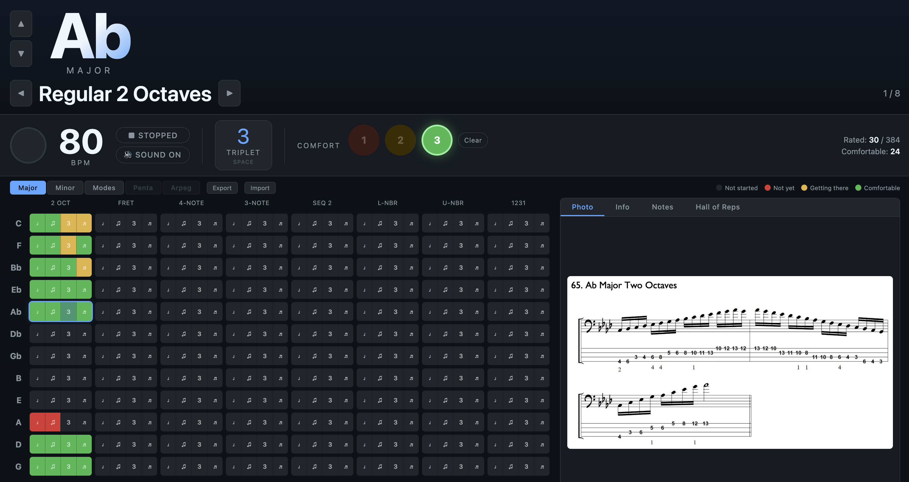
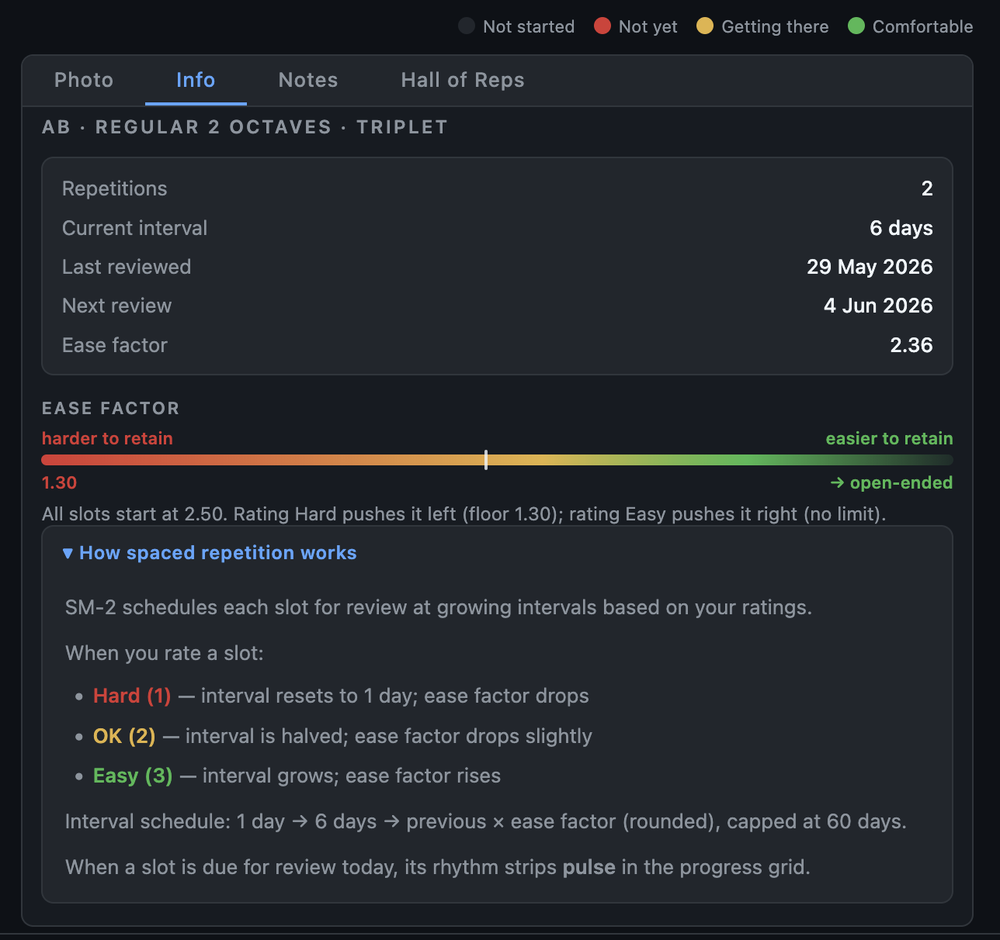
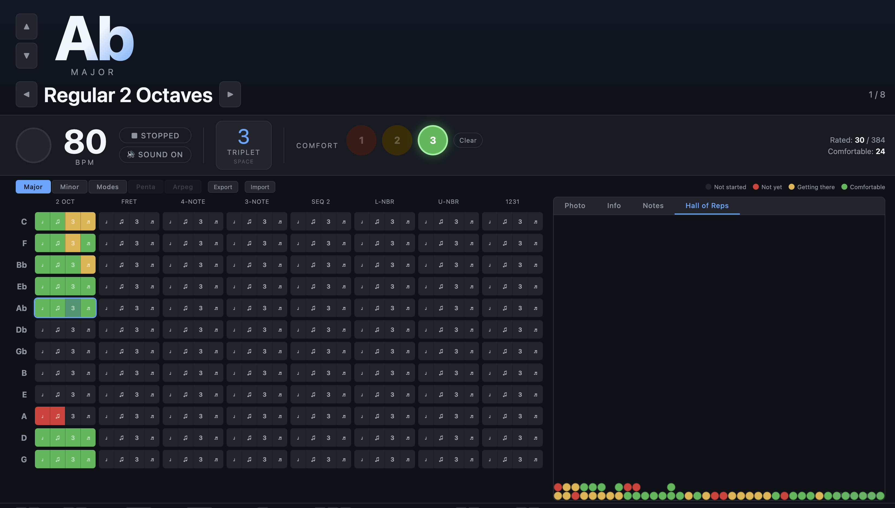

# Bass Scales Trainer

An offline, single-file bass guitar scale practice app with spaced repetition scheduling.

## Features

- **Five universes of material:** Major scales, Natural Minor scales, Modes (Dorian–Locrian, key-derived), with Pentatonic and Arpeggios planned
- **12 keys** per universe — Major/Modes follow the circle of fifths (C, F, Bb…); Natural Minor uses its own key set (A, E, D, B, G, F#…)
- **8 playing variations** per scale (2 Octaves, Fretboard, 4-Note Seq, 3-Note Seq, Sequential Seconds, Lower/Upper Neighbour, 1231)
- **4 rhythmic variations** per slot (Quarter, Eighth, Triplet, 16th) — toggleable via the "RHYTHMS ON/OFF" pill; when off, only Quarter Note is shown/trained and the grid slot expands to fill the space of all 4. Other rhythms' data is preserved and reappears when re-enabled
- **SM-2 spaced repetition** — each slot is scheduled independently; due slots pulse in the grid; interval growth is capped at 30 days
- **Comfort ratings** — 1 (Hard), 2 (Getting there), 3 (Comfortable) — with undo and clear support
- **Built-in metronome** — BPM stored per slot, with mute and tap-to-play
- **Circle of 4ths mode** — click a column header to toggle it; one rating then applies to all 12 keys at once, for practising a variation as an unbroken run through the circle rather than key-by-key. Reversible at any time; the due-count badge counts a circle-mode variation once, not per key
- **Hall of Reps** — physics-inspired visualisation of practice history; balls drop and stack by colour (red/amber/green); circle-of-4ths reps land with a gold ring
- **Progress grid** — at-a-glance view of all keys × variations × rhythms; hover any cell to see when it was last reviewed
- **Notes** — per-slot freeform text notes
- **Export / Import** — full JSON backup and restore

## Usage

Open `index.html` directly in any modern browser. No server, no build step, no dependencies.

All data is stored in `localStorage`. Use Export to create a backup JSON file.

## Keyboard Shortcuts

| Key | Action |
|---|---|
| `↑` / `↓` | Previous / next key |
| `←` / `→` | Previous / next variation |
| `Space` | Cycle rhythm |
| `Enter` | Play / stop metronome |
| `M` | Mute / unmute audio |
| `1` / `2` / `3` | Rate comfort (re-click to re-affirm) |
| `0` | Clear (reset) current slot |
| `[` / `]` | BPM ±5 |
| `,` / `.` | BPM ±1 |

Click the scale photo to view it fullscreen. While fullscreen, `←` / `→` cycle to the previous/next key around the circle of 4ths (e.g. C major → F major → Bb major…; A minor → D minor → G minor…); `Esc` closes it.

## Photos

Scale fingering photos live under universe-specific subfolders:

- `major-scales/pngs/` (JPEG fallback: `major-scales/jpgs/`)
- `natural-minor/pngs/` (JPEG fallback: `natural-minor/jpgs/`)

Filename convention: `<key-slug>-<type>-<variation-slug>.png`, e.g. `c-major-2-octaves.png`, `a-natural-minor-fretboard.png`.

Sharp keys use spelled-out slugs: `f-sharp`, `c-sharp`, `g-sharp`, `d-sharp`.

## Screenshots

